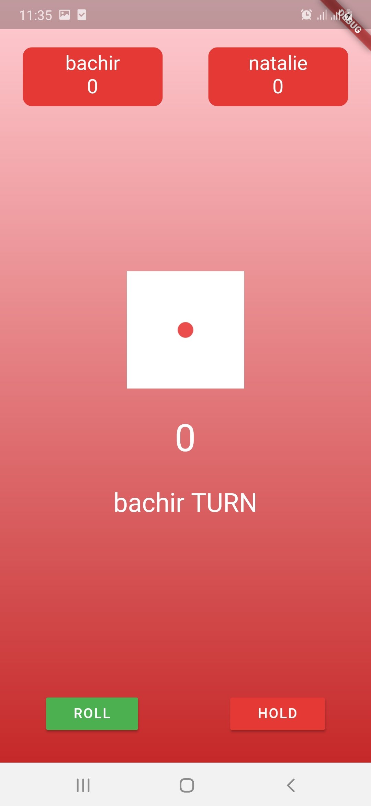
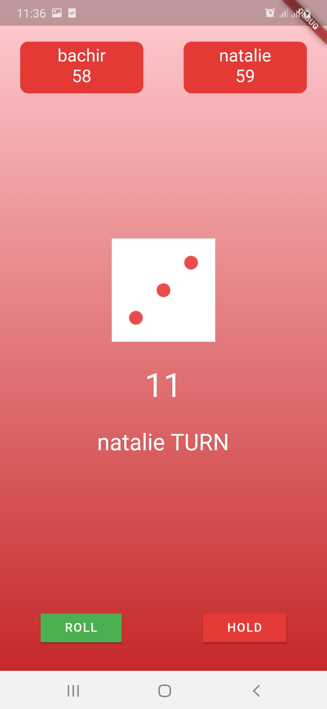
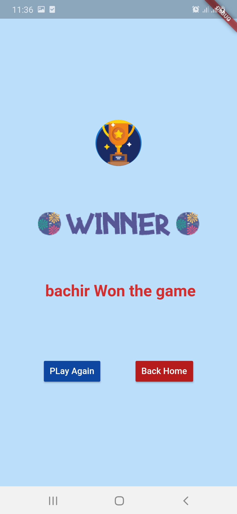

# flutter Dice Game
A new simple dice game made with Flutter.

## Acknowlegement
All the images came from the following sources and were marked Free for personal and commercial purpose with attribution:
- https://www.flaticon.com/free-icon/trophy_861506?term=trophie&page=1&position=54	
- https://www.flaticon.com/free-icon/dice_2484591?term=dice&page=1&position=61

## Open to new suggestions or improvements 
if you have any suggestions to improve the game or some new features to be implemented, feel free to open a new issue descrbing your idea.

## Getting Started
This project is a starting point for a Flutter application.
- to run this app you need to install the [Provider](https://pub.dev/packages/provider) package first.

A few resources to get you started if this is your first Flutter project:

- [Lab: Write your first Flutter app](https://flutter.dev/docs/get-started/codelab)
- [Cookbook: Useful Flutter samples](https://flutter.dev/docs/cookbook)

For help getting started with Flutter, view our
[online documentation](https://flutter.dev/docs), which offers tutorials,
samples, guidance on mobile development, and a full API reference.

## Screen Shots

